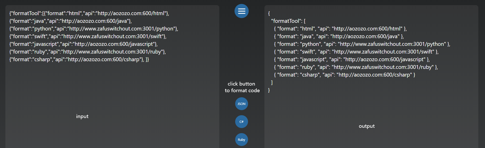

# formatCodeTool
A Tool can format  Java Python C# Swift PHP Ruby HTML Javascript Typescript Json Vue Angular Markdown GraphQL...

## 工具介绍  Introduce

这是一个可以用来格式化代码的工具, 支持的代码类型包括如下语言

```
html|javascript|typescript|json|markdown|vue|angular|yaml|graphql
java|python|c#|swift|php|ruby|apex|xml
//目前只加了其中的一些, 剩余的一些语言可使用Api进行格式化
```



## How to use

将未格式化的代码放入左侧文本框, 点击想要转换的代码类型按钮, 若转换成功, 会在右侧文本框输出内容

下载文件, 打开 index.html 即可使用, 或访问 http://aozozo.com 使用在线工具


## formatCodeApi

https://github.com/duoqiang6/formatCodeApi

